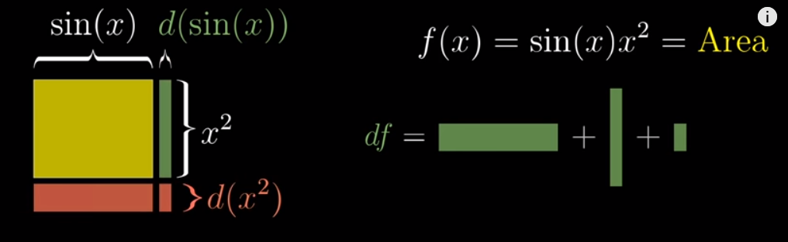

# The Essence of Calculus

## Chapter 1

Start point: calculate the area of a circle.

hard problem -> sum of many small values

We can get the idea that at high level, many problem can be regarded as finding the area under some graph.

The function trying to find this area is called Integral of the original function.

so, 

$$ dA / dx = x^2 $$

which can be called **Derivative**, which measures how sensitive a function is to small changes in input. (It is also a key to solve integral)

when dx becomes smaller, this formular become more accurate.

## Chapter 2 The paradox of the derivative.

paradox:  instantaneous rate of change?

but change requires multiple points in time (to measure), while Instantaneous = one point in time

can be calculated as the slope of **two points** when gap (dt) is infinitely small.

$ds(t)/dt = (s(t+dt) -s(t)) / dt$ 

BUT, pure math derivative: tangent at a **single point**. which makes dt very close to 0

regard this tangent as **Best constant approximation around a point (range)** instead of instantaneous change

The process of calculate $s(t) = t^3$. When dt is tent to 0, the item contains dt can be ignored and finally we can get $3t^2$

## Chapter 3 Derivative formulas through geometry.

visualise $x^2$ and $x^3$ as square and cube, see how area or volume changed when add small $dx$

The point: most of the complication can be ignored and the bigest one is reserved.

## Chapter 4 Chain rule

add:  $d(g(x)+h(x)) / dx = dg/dx + dh/dx$

product:  $d(g(x)*h(x)) / d(x) = g(x)*dh/dx+ h(x)*dg/dx$

***Chain rule** - composition: 

$d(g(h(x))/dx = d(g(h(x)))/dh * dh(x)/dx = dg/dh * dh/dx = dg/dx$

$d(g(h(x))/dx = g'(h(x))*h'(x)$

## Chapter 5 Derivatives of exponentials

$e^x$

So, we can get $2^t * (2^{dt} - 1) / dt$
For $(2^{dt} - 1) / dt$ which has no relation with time t, it tends to a constant $0.6931472...$

In fact for all $n^t$ we can find a different constant * itself as the derivative

the number $e$ is defined to make $(e^{dt} - 1) / dt$ equal to 1.

so, $\frac{d}{dt}(e^t) = e^t$

For those constant, we use chain rule to related to $e$.
$2 = e^{ln(2)}$

$2^t =e^{ln(2)t}$

so, the derivative of $2^t = ln(2) * e^{ln(2)t} = ln(2)*2^t$

In fact there can be many different ways to express, we use $e$ since it is the proportionality constant btw **the size of changing variable and the rate of change**. 

## Chapter 6 Implicit differentiation

implicit curve: not simply y = f(x), x and y are correlated via some relashionship. It's just the set of all points(x,y) that satisfy some property written in terms of the two variables x and y.

we just regard them as (x,y), and the changing on these components will cause on changes on the whole pair.

Another example to use this:

so, $\frac{dy}{dx}=\frac{1}{e^y}=\frac{1}{x}$

## Chapter 7 Limits

RHS is the formal derivative definition.
$h = dx$

introduce h because someone think dx means infinite small, while someone think dx is just a value.

To conclude, we are talking about **the size of change approaches to zero** instead of **infinitely small changes**.

so, we need  to understand the meaning of **approach**

$(\epsilon,\delta)$

$\epsilon$ for the output distance (when trying to approach the limit), it may cannot be smaller when limit does not exist.

for second case, the $\epsilon$ is too small, no matter how small the $\delta$ is, the output is always bigger.

how to comput limit?
"L' Hopital's rule"

In the case of $\frac{0}{0}$, the limit can be calculated via

There are other cases for L' Hopital's rule.

## Chapter 8 Integration and the fundamental theorem

Inverse of the derivatives

use lower bound to make sure the correct constant.

To cancel T=0

Calculate area:
Fundamental theorem of calculus:

Negative area: backwards; will be substracted.

Integral == signed area between the graph and the horizontal axis.

## Chapter 9 What does area have to do with slope?

## Higher order derivatives

## Chapter 10 Taylor series