# Essense of Linear Algebra 

Link: https://www.youtube.com/playlist?list=PLZHQObOWTQDPD3MizzM2xVFitgF8hE_ab

Geometric intuition is helpful.

## Vector

physics: direction + length

CS: ordered lists of numbers

Math: generalize both: can be anything where **adding** 2 vectors and **multiplying** with a number is meaningful.

an arrow rooted at origin

the meaning of LA can be regarded as achieving the transformation btw ordered lists and arrow in space

what happned in space? -> to vector

## Vector Space

Consider components of a vector as a scalar which working on two special unit vector, which is along x-axis and y-axis, called i_hat(along x) and j_hat(along y)

i_hat and j_hat are the **basis vectors** of the xy coordinate system. We can choose **different** basis vectors.

**linear combination** of two vectors (Scalars+addition)

why call linear: if you fix one vector and change another vector, you will get a line

( maybe two vectors in one line; or even two zero vectors

The **span** of two vectors is the set of all their **linear combinations**, which is the addition and scalar.

In fact, a vector should be regarded as an arrow. but, it is too crowed when we describe loads of vectors. So when think of sets of vectors, we regard them as **points**. 

three dimensional vector: two vectors form a  plane. the last one can be regarded as moving this plane on its direction. finally form the whole room

Redundant vectors : linearly dependent

if all vectors add dimension to the span: linearly independent

**The basis of a vector space is a set of linearly independent vectors that span the full space.**

## Matrix as Linear transformations

transformation = function

vector input -> vector output

use **transformation** instead of function as it suggests a **movement**.

**Linear** transformations has two properties:

1. all lines must remain lines without getting curved
2. the origin must remain fixed in place

(can be regarded as keeping grid lines parallel and evenly spaced)

How to represent it numerically? Use basis vector.

The linear combination relationship of vectors keep the same after linear transformation

**input vector = x * (i_hat) + y * (j_hat)**

**Transformed vector = x * (Transformed i_hat) + y * (Transformed j_hat)**

For this kind of 2-dimensional linear transformation, we only need to know the transformed i_hat and j_hat, and apply it to any vector we want to transformed (the input vector) to get the output vector. It meets the idea of **scalar the basis and then adding them**

for general:

a b

c d

in fact it should be regard as combination of two basis which are [a; c] and [b; d]

when apply this matrix to some vector like [x; y], that is, time x to [a; c] and y to [b; d]

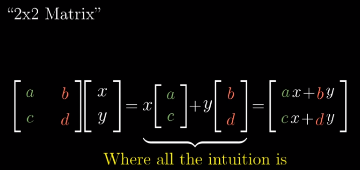

apply the transformation matrix [a b; c d] to the input vector [x;y];

Special case : **Shear** : In this transformation, i_hat keep the same: the first column [1; 0]; j_hat becomes [1; 1];

The important idea: **every time when you see a matrix, regard them as a certain transformation of the space.**

## Matrix multiplication as composition

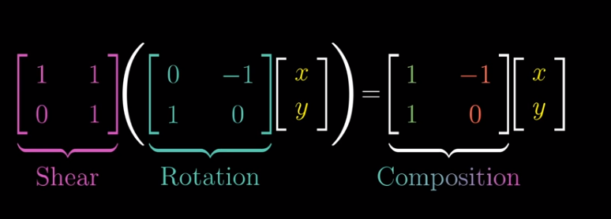

So, the multiplication of two matrices can be regarded as applying a series of transformation. 

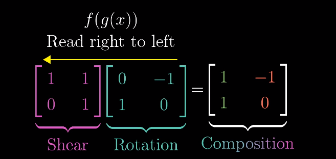

as when applying functions, it is from right to left, so there is the same.

So, the really computation is: finding where i_hat lands; then finding where j_hat lands:

For i_hat, the first one is [e; g]; applying M2 to [e; g] which meaning finding the transformation with M2 of first version basis [e; g]; 

So, is M1M2 =M2M1? **NOT**

To prove the associativity: (AB)C = A(BC) without numerically computing:

for LHS: applying C transformation firstly, then B then A;

for RHS: applying C transformation and B transformation, then A;

They are the same! applying 3 transformations in the same order.

## Three dimensional linear transformations

i_hat; j_hat; k_hat(along z axis)

The same idea as before: regarding a matrix as a transformation of the space.

Applying each basis the second transformation.

## The determinant

Measure how much are areas(one grid) scaled with a matrix(transformation).

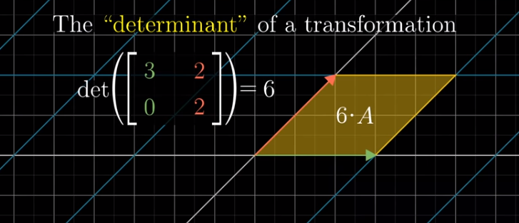

from [1,0; 0,1] to this matrix with basis(3,0) and (2,2) the scalar of area is 6, which means that after transformation, the area of a unit grid increasing to 6 times the origin area, which is, the determinant is 6.

The determinant of transformation is 0 if it  squishes all the space to a line and even a point -> **checking the determinant is 0 = checking if the transformation squishes the space into a smaller dimension**

How about negative determinant? flipping the space. the number is still the scalar. Thinking the changing of determinant: i_hat and j_hat becomes closer, the determinant is approaching to 0, then i_hat and j_hat changing position, the determinant become negative.

For 3-D, determinant means the scalar of volumes. So 0 means it be squished to a 0 volume thing, a plane, line and even a point. So we can see that this 3-D matrix is linearly dependent.  For the det(M)<0, if the origin is right-hand-rule, now after transformation, it becomes left-hand-rule.

How to calculate det(M) then?

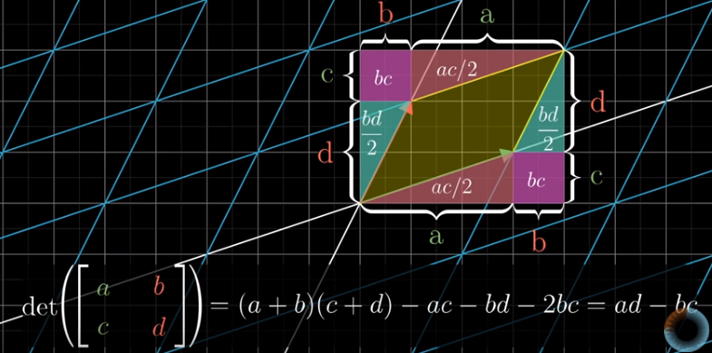

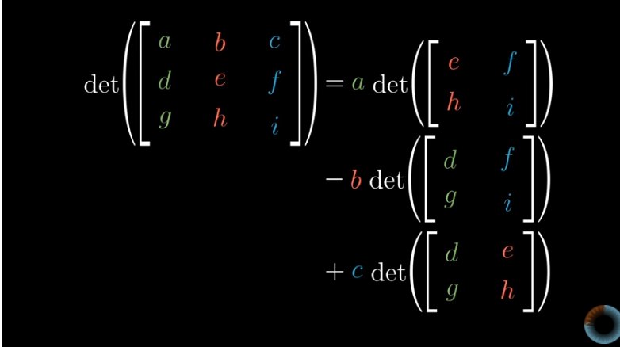

det(M1M2)=det(M1)det(M2)?

as LHS can be regarded as the composition of two transformation and then find the final scalar of area. For RHS, it can be regarded as find the scalar of each transformation and then multiply them. So it should be the same.

## Inverse matrices, column space and null space

Linear system of equations:

for non-appear variables, let the coefficient be 0.

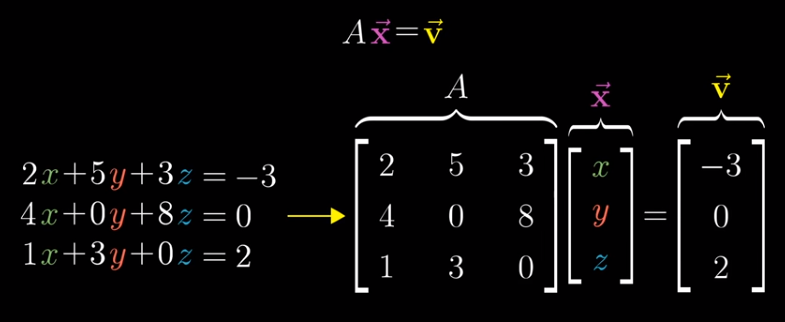

The geometric meaning is, try to find an vector x that after transformation A, it can become vector v.

**Inverse matrices**: The inverse transformation. A-1 .

A-1A = transformation that does nothing = I

Solution: det(A)=0? IF not equals to 0, simply apply inverse matrix to vector v. IF equals 0(lower dimension), there is no inverse matrix as you can not transform a line to a plane( in this case, you need to transfer each line to a plane, but function can only transform an input to an output). In this case, we need to let the vector v on the line which is the result of decreasing the dimension with the transformation A. In a 3x3 matrix, the space squished as a line is stricter to find a solution than being squished as a plane, even both det(A) = 0. To describe it, use **rank**.

Rank: when the result of transformation is 1-dimensional, call it **rank 1**. When the result of transformation is 2-dimensional, call it **rank 2**. **Rank means the number of dimensions in the output**. For example: for a 3x3 transformation, it can have rank 3, 2 and 1.

Set of all possible outputs A*vector v == column space of A. Help us make sure whether solution exist.

**Column space**: **The span of the columns in the matrix**. tell you where  the basis lands. So, **rank is the number of dimensions in the column space**. Full rank equals to the number of columns. 

Notice: zero vector is always in the column space. Since origin keep the same. For full rank transformation, only zero vector keep the same location before and after transformation. For not full rank, as the dimension is decreased, a bunch of vectors will be squished to zero. This set of vectors that lands on the origin after transformation is call **Null space** or **Kernel**.

**Null space: the set of vectors that lands on the origin after transformation**. For 3x3, when it squished to a plane, it may be vectors in a line. If the space is squished to a line, then the null space can be a plane.

When A * vector X = vector v, if v is a zero vector, then the null space of the A give all the possible solutions.

## Nonsquare matrix:

Transformation between different dimensions input and output.

For a 3 x 2 matrix, it is a 2-d plane  slicing through the origin in a 3-d space, span of columns <=> Column space. Two columns means the input space has two basis vectors, three rows means each basis vector described with three coordinates.

A 3x2 matrix can still be full rank if the number of dimensions in its column space is the same as the number of dimensions of the input space(linear independent).

For 1 x 2 matrix, it is taken a 2-d plane and squishing it to an axis.  For example, [1 2] take i_hat to 1, and j_hat to 2.

## Dot products and duality

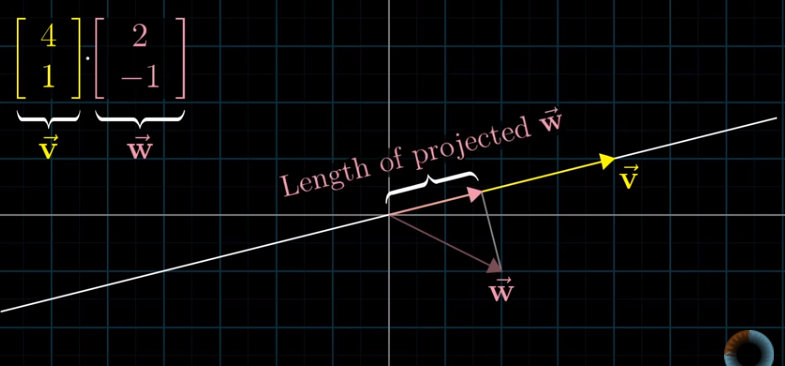

dot(v,w) = length of projected w * length of v

if the angle is larger than 90, than it should be negative

perpendicular: dot(v,w) = 0

**Order does not matter**.

Why the multiplying each row and adding them together has relations with projection? --> **Duality**

We can see that there may be some relation between 1 x 2 transformation and 2-d vector as, in numerical, they look similar.

If we set an axis with basis u_hat in the 2-d space and try to find the transformation matrix from the 2-d space to this axis, we can get this matrix via symmetry  

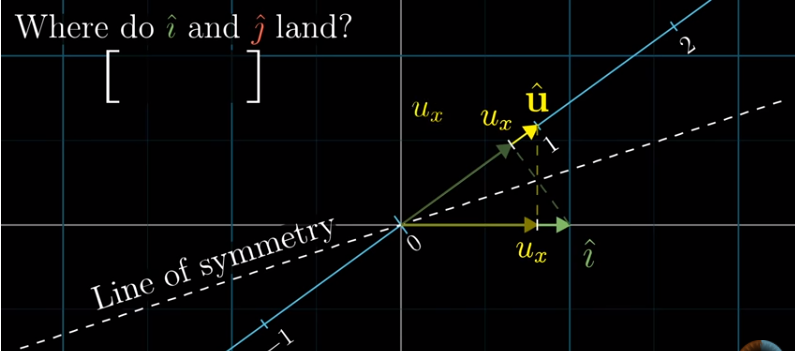

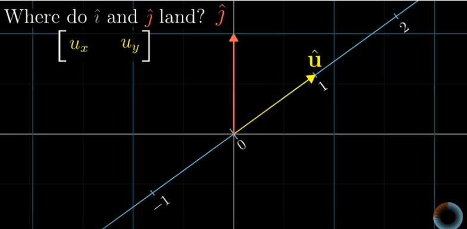

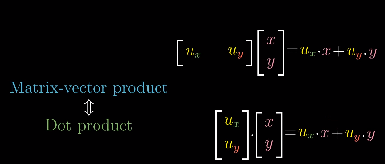

So dot with unit vector can be regarded as projected vector to the unit vector and taking the length. For non-unit vector, just equals scaling the projected length. 

To sum, any time you have a 2d to 1d linear transformation like [4 1], applying the transformation is as same as dot product with this vector.

**This is a kind of duality**. Natural but surprising correspondence. Here the dual of a vector is the linear transformation that it encodes. The dual of a linear transformation from space to 1 dimension, is a certain vector in that space.

vector <=> transformation

Vector can be regarded as a physical embodiment of linear transformation as it is much easier to image the transformation of an arrow rather than the transformation of the whole space.

## Cross product

Standard intro.:

cross(v, w) = area of parallelogram. **Order matters**

To remember order: i_hat x j_hat = +1 where i_hat lands on the x axis.

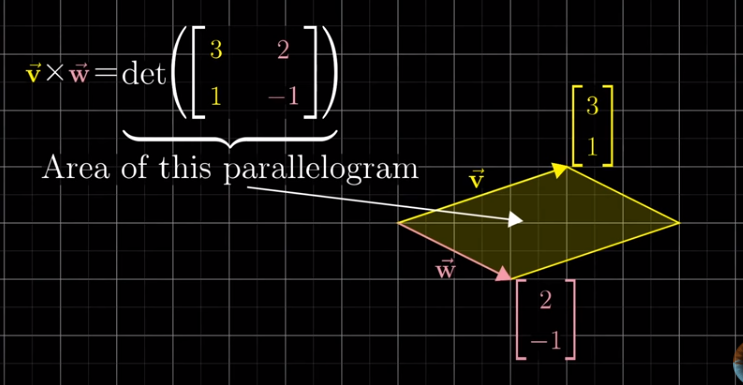

3v x w = 3 (v x w); 

The true CROSS PRODUCT is given two 3-d vectors and output a new 3-d vector. (however,the area of given two vectors will equal to the length of the output vector, and the direction of the output will be perpendicular to the parallelogram, according to the right hand rule: x for the first vector, y for the second vector, z for the output ). 

For numerical calculation:

Linear transformations understanding:

determinant and duality

here: 1. define a 3d to 1d linear transformation; 2. find its dual vector 3. show the dual is v x w.

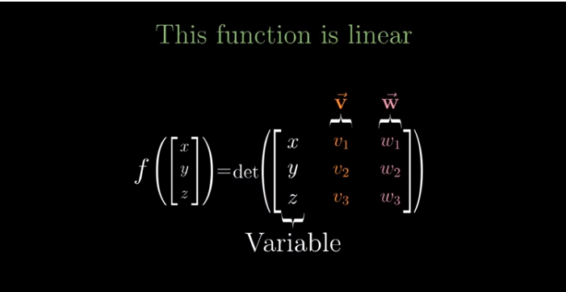

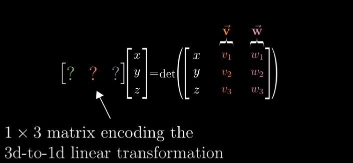

Then turn the 1 x 3 matrix to 3 x 1 according to duality. Then make the dot product to get the result. What we need to do is to find this special vector.

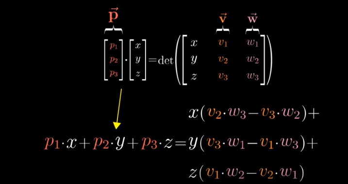

so the coordinates of p is the coefficients of  x y z.

## Changes of basis

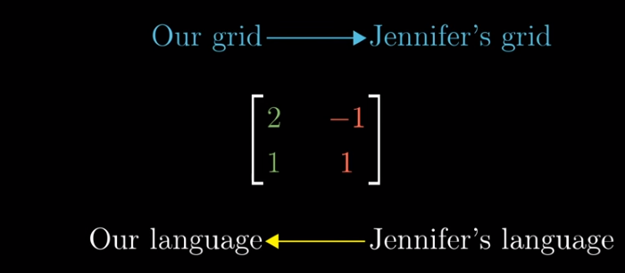

Inverse: back transformation.

AX = Y, X = A-1Y.

How to get a vector translated 90 in another set of basis?

A-1MA, where rightest A is changing the vector in other basis to our basis, applying M is the rotation, then apply the A-1 to transformed back to its basis. (Represent the transformation of views).

## Eigenvectors and eigenvalues

after linear transformation, some vectors remain in their span, for them the transformation only applying scalar without any rotation. These vectors are called the eigenvectors. Eigenvalue is how much the corresponding eigenvector compressed or expanded.

If you can found an eigenvector in 3D space, then in fact that is the axis of the rotation. It is much easier to see the rotation as a rotation round this axis with some angle, rather than a 3x3 matrix.

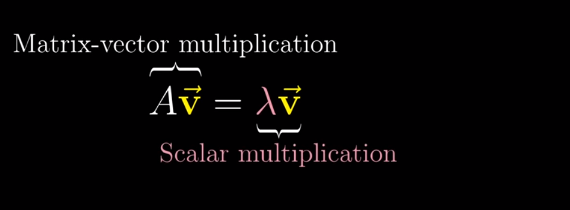

scaling by lambda, can be regarded as multiply a diagonal matrix with lambda in each [x,x]. = lambda * Identity matrix with 1.

For a diagonal matrix, each basis is an eigenvector and the number exists is its eigenvalue.

A easy way to calculate v^n (applying same transformation n times) is to change it to a coordinate described by its eigenbasis(if it has enough eigenvectors to span the whole space spanned by the v, ex, for 2D v, it need a pair of linearly independent eigenvectors), than calculate n times in eigenbasis, finally transformed it back to the origin coordinates via v-1. As in Eigenbasis, the transformation is described as a diagonal matrix which is much easier to calculate.

## Abstract vector spaces

Determinant and eigenvectors do not care about the coordinate system

function is similar with vectors, only, there are infinite of coordinate need to be added or scaling. So, there are also, linear transformations, dot product, null space, eigenvectors in function.

Linear transformation = linear operators in function. 

What does it means for linear in function:

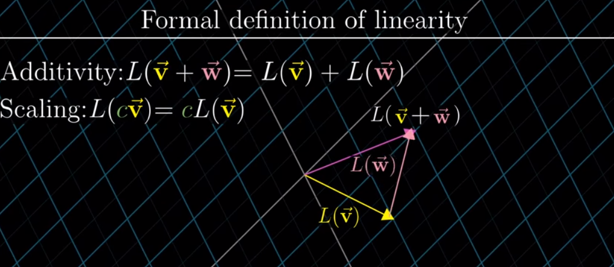

Derivative is linear operator:

d(f+g)/dx = df/dx + dg/dx;

d(k*y)/dx = k * (dy/dx);

To regard derivation as linear operator, set basis as infinite set of {1, x, x^2, x^3, x^4,...}

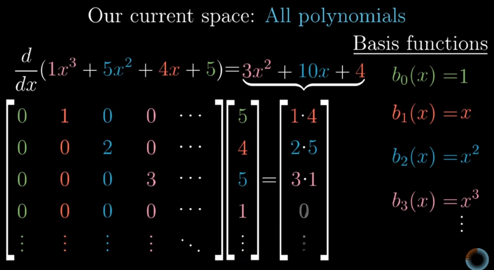

Corresponding relationship btw concepts in vectors and function

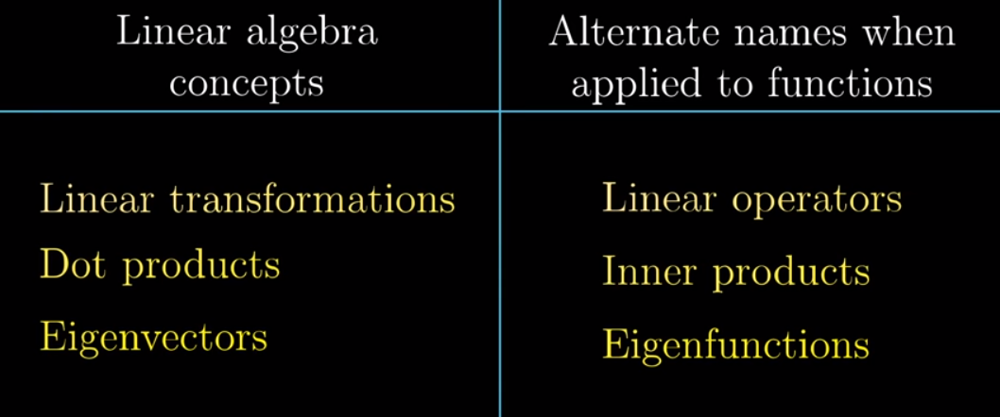

There are lots of vector-ish things in math. all the things like linear transformations, dot product, null space, eigen-xxx, should be able to apply.

Set of vector-ish things all can be called vector spaces. So, scientists set rules for vectors addition and scaling., axioms (checklist), to define a vector space, which may be used when others want to define a new "strange" vector space <-**abstract**, so you do not need to focus on such as an arrow or lists as vector. "vector" can be anything, pictures, functions etc.

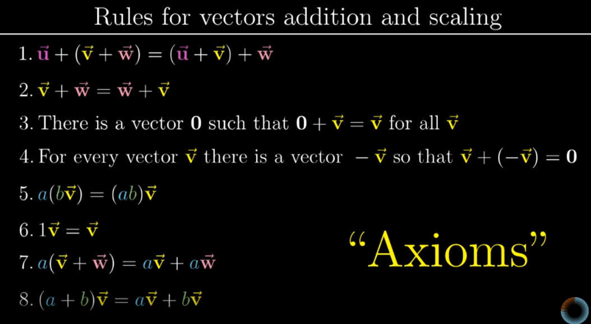

Finished.

London. <2018/2/19>