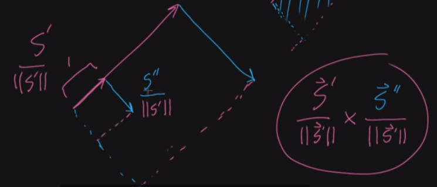

# Curvature

## 2D curvature formula

measure how much the curve curves.

R = the radius of the curvature.

curvature  k = 1/ R.

vector s(t) = [x(t), y(t)]'  = [t-sin(t), 1-cos(t)]'  -(In class different pattern is used)

s(t) is the vector in curve parameterized by t.

both T and S are vector-valued functions:

dT / ds  -- T is the tangent vector, s is the arc length of curve, meaning that if you get a tiny step in the curve, how much does the unit tangent vector change.

|| dT/ds ||, the size, how much the curve curves.

to calculate T: for s, derivative and normalize it(divided by length sqrt(x^2 + y^2); radius R for a unit circle example), which results in the unit tangent vector function.

For a circle:

|| dT/ds || = || dT/dt || / || ds/dt || = 1/R

T = (ds/dt) / length (unit tangent vector function)

For general:

In fact, the part above can be regarded as cross(s'(t), s''(t)), the first is the tangent vector, and the second is measure how tangent vector changes(both direction and rate(speed of changing). As the cross product is the area of two vectors, we can regard this dot cross as a measurement measuring how curve curves after normalization of s'(t) and scaling down of s''(t). for s''(t) we do not normalize it as the scale of it tells the speed of tangent vector changes. It equals to dT/dt.

as the curvature is ||dT/dS|| = ||dT/dt|| / ||dS/dt||, and ||dS/dt|| = ||S'||, while the circle part above is dT/dt,

 so we can get

(with || || magnitude in S' x S'') as another formula of curvature.

(The idea of this formula, can be regarded as, using the area to express the changing rate).

(To conclude, use area(cross product) as we only need the perpendicular part in the second derivate of S, which is the real changing rate(tangent vector) of the tangent vector of the original curve. The scale of it measures how big the rate is, so no need to normalize it)

## 3D curvature of a helix

The same idea. Find T(t) = S'(t) / || S'(t)||

 || S'(t)|| = sqrt(x^2, y^2, z^2) (for each components when calculating)

Calculate the curvature by ||dT/dS|| = || dT/dt  /  dS/dt ||

## 2D curvature of a cycloid

use formula directly.

