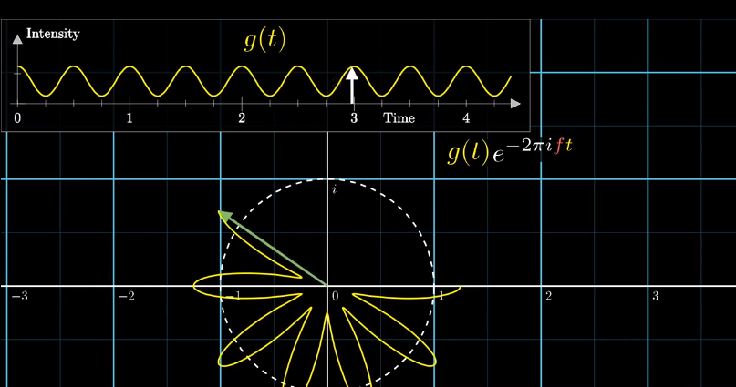

# Fourier Transform

Link: https://www.youtube.com/watch?v=spUNpyF58BY

Original intensity vs. time graph (eats/second)

wound-up version of the first graphy in 2d plane.

How the winding frequency influences the centre of mass of the second graph.

Get a spike when the winding frequency is the same as the signal frequency:

"Almost" Fourier transform"

For complex intensity-time wave, the wound-up graph will be clear when winding frequency = 2/3, so from mass graph we can get the components:

Reason:

Application: FT the intensity-time graph to frequency one, then in the frequency graph, we can just "delete" one height peek, and keeping the rest, to delete some kind of signal/sound in the original version. Then, apply the inverse FT(another FT), the frequency version can be transformed back to the intensity-time graph.

The real Fourier transform: as we just consider the x-coordinate of the mass for convenient, however, we need to consider both x-y this time. **Complex plane**. The centre of the mass is a complex number, eg, 0.2-0.4i.

complex number can describe rotation very well:

e^n*i^    means walk n units around a circle with radius 1 from right ( which is (1,0)) in counter-clockwise.

e^2pi *i *t^ where t is the amount of time passed. It means a rotating at a rate of 1 cycle per second. 2pi as it is the full length of the circle with radius 1.

e ^ 2pi * i * f * t : here f is the frequency. ex: 1/10, then every 10 second it walks a circle, as only when t = 10(s), it equals 2PI*i.

For FT, usually the rotating is in clockwise. so, use e^-2pi* i * f * t^. Let the original intensity-time sinusoid be g(t), then we can describe second graph, the wounding-up grapy as  g(t)* e^-2pi * i * f * t^, meaning the rotation function is scaling by the g(t).

Meanwhile, as f exists, so the frequency is changeable.

But, how to get the mass? We can sample some points in the g(t), and find the correponding location in wound-up graph, add their location and divided by the number.

In the limit, it is not the sum of a whole bunch of points, instead, take an integral of the function divided by the size of time interval that we're looking at.

Final step, move the interval, now the meaning is not the centre of mass, but scaling it up by some amount, like, if it was continuous for 3 seconds, then scaling it by 3 times. Physically, when a certain frequency persists for a **long time**,  the magnitude of the FT at that frequency is scaled up more and more.

Additionally, use infinity to instead t1 and t2.

To sum up, the FT of a intensity-time function is a frequency function, which can be regarded as a wound-up graph, outputting a complex number, which corresponds to the strength of a given frequency in the original signal.

Finished.

<20180221> London.